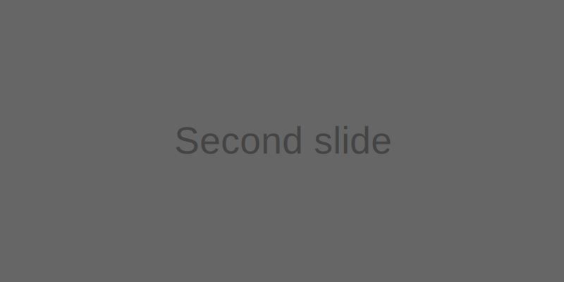
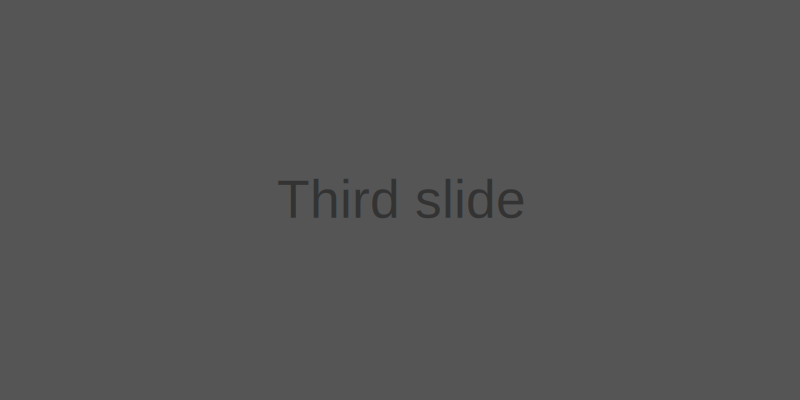

# Carousel
A slideshow component for cycling through elements—images or slides of text—like a carousel.

::: demo Slides only
```html
<bs-carousel :show-indicators="false">
  <bs-carousel-item>
    
  </bs-carousel-item>
  <bs-carousel-item>
    
  </bs-carousel-item>
  <bs-carousel-item>
    
  </bs-carousel-item>
</bs-carousel>
```

::: demo With controls
```html
<bs-carousel :show-indicators="false" show-control>
  <bs-carousel-item>
    
  </bs-carousel-item>
  <bs-carousel-item>
    
  </bs-carousel-item>
  <bs-carousel-item>
    
  </bs-carousel-item>
</bs-carousel>
```
:::

::: demo With indicators
```html
<bs-carousel show-indicators show-control>
  <bs-carousel-item>
    
  </bs-carousel-item>
  <bs-carousel-item>
    
  </bs-carousel-item>
  <bs-carousel-item>
    
  </bs-carousel-item>
</bs-carousel>
```
:::

::: demo With captions
```html
<bs-carousel show-indicators show-control>
  <bs-carousel-item>
    
    <template slot="caption">
      <h3>First slide label</h3>
      <p>Nulla vitae elit libero, a pharetra augue mollis interdum.</p>
    </template>
  </bs-carousel-item>
  <bs-carousel-item>
    
    <template slot="caption">
      <h3>Second slide label</h3>
      <p>Lorem ipsum dolor sit amet, consectetur adipiscing elit.</p>
    </template>
  </bs-carousel-item>
  <bs-carousel-item>
    
    <template slot="caption">
      <h3>Third slide label</h3>
      <p>Praesent commodo cursus magna, vel scelerisque nisl consectetur.</p>
    </template>
  </bs-carousel-item>
</bs-carousel>
```
:::
